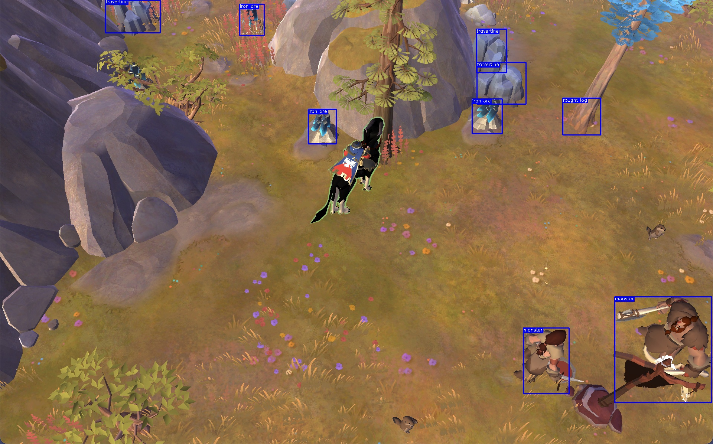

<div id="top"></div>


<!-- PROJECT LOGO -->
<br />
<div align="center">
    

<h3 align="center">Object detection Yolov5</h3>

  <p align="center">Bored to farm all day in albion only (I'm kidding). Learn about object detection and yolov5</p>
    
</div>


 <br />  

<!-- TABLE OF CONTENTS -->
<details>
  <summary>Table of Contents</summary>
  <ol>
    <li>
      <a href="#about-the-project">🧭 About The Project</a>
      <ul>
        <li><a href="#built-with">🏗️ Built With</a></li>
      </ul>
    </li>
    <li>
      <a href="#getting-started">📋 Getting Started</a>
      <ul>
        <li><a href="#prerequisites">🗺️ Prerequisites</a></li>
        <li><a href="#installation">⚙️ Installation</a></li>
      </ul>
    </li>
    <li><a href="#usage">💾 Usage</a></li>
    <li><a href="#contributing">🔗 Contributing</a></li>
    <li><a href="#license">📰 License</a></li>
    <li><a href="#contact">📫 Contact</a></li>
    <li><a href="#acknowledgments">⛱️ Acknowledgments</a></li>
  </ol>
</details>

<br>


<!-- ABOUT THE PROJECT -->
## 🧭 About The Project

### 🏗️ Built With

List of technologies / frameworks used during the project.

* Python 3.8
* Pytorch
* Yolov5
* Albion Online
* OpenCV
* Numpy
* Roboflow

<p align="right"><a href="#top">⬆️</a></p>


<!-- GETTING STARTED -->
## 📋 Getting Started

I'd always wonder how to make a object detection model and how to use it in a real case scenario. I decided to use Yolov5 and make a scanner for Albion Online. The goal is to detect the resources on the screen and click on the coordinate, do this in loop.

### 🗺️ Prerequisites

Python 3.8 is required to run the project.

Albion Online is also required to run the project.

Create an account on Roboflow and download the dataset in Yolov5 format.
At this url: https://universe.roboflow.com/albiononline-c8fxi/albiongathering

You could large the data set adding your own images.

Get the data set and put it in the yolov5 folder and run the train set (could use google collab to train data using GPU).

```bash
python train.py --img 640 --epochs 3 --data coco128.yaml --weights yolov5s.pt
```

Testing folder, is a folder that contains my test during development phase.

<p align="right"><a href="#top">⬆️</a></p>


<!-- USAGE EXAMPLES -->
## 💾 Usage

Before running the project, you need to install the requirements.

```bash
pip install -r requirements.txt
```

Start Albion Online and go to the resource you want to farm. Then you can run the project with the following command.

In the Application folder you can find the main.py file. Run it with the following command., With or without the debug flag in the AlbionDetection class.

```bash
python main.py
```

<p align="right"><a href="#top">⬆️</a></p>


<!-- CONTRIBUTING -->
## 🔗 Contributing

Contributions are what make the open source community such an amazing place to learn, inspire, and create. Any contributions you make are **greatly appreciated**.

If you have a suggestion that would make this better, please fork the repo and create a pull request. You can also simply open an issue with the tag "enhancement".
Don't forget to give the project a star! Thanks again!

1. Fork the Project
2. Create your Feature Branch (`git checkout -b feature/AmazingFeature`)
3. Commit your Changes (`git commit -m 'Add some AmazingFeature'`)
4. Push to the Branch (`git push origin feature/AmazingFeature`)
5. Open a Pull Request

<p align="right"><a href="#top">⬆️</a></p>


<!-- LICENSE -->
## 📰 License

Distributed under the MIT License. See `LICENSE.txt` for more information.

<p align="right"><a href="#top">⬆️</a></p>


<!-- CONTACT -->
## 📫 Contact

Reach me at : gauron.dorian.pro@gmail.com.

Project Link: [https://github.com/Michelprogram/magic-scanner.git](https://github.com/Michelprogram/magic-scanner.git)

<p align="right"><a href="#top">⬆️</a></p>


<!-- ACKNOWLEDGMENTS -->
## ⛱️ Acknowledgments

This space is a list to resources i found helpful and would like to give credit to.

* [Roboflow](https://roboflow.com/)
* [Roboflow deploy](https://docs.ultralytics.com/yolov5/tutorials/train_custom_data/)
* [Yolov5](https://github.com/ultralytics/yolov5)
* 
  
<p align="right"><a href="#top">⬆️</a></p>

<a href="https://github.com/othneildrew/Best-README-Template">Template inspired by othneildrew</a>
